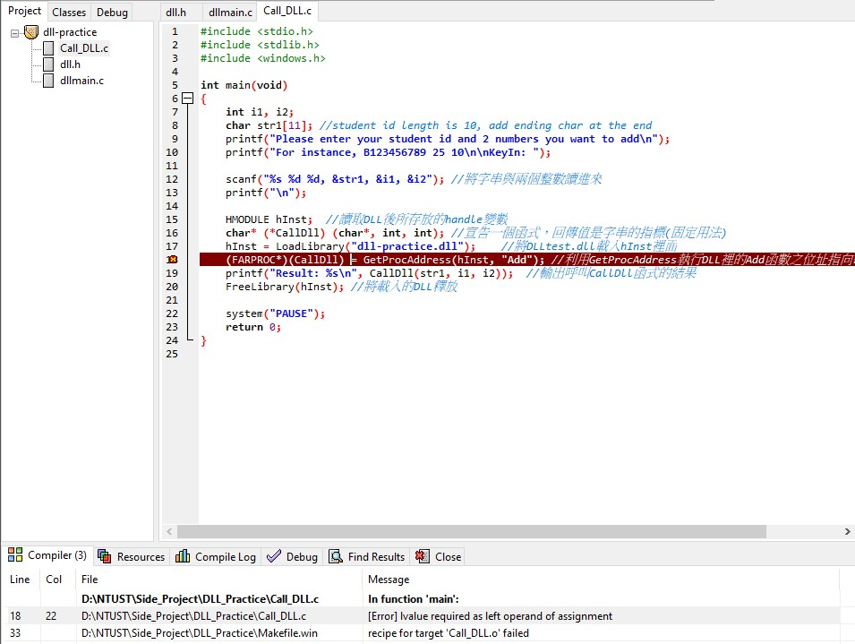

# dll_practice

## Project Purpose
* This project is just a DLL file practice for myself and often refers to some website notes such as [Web1](https://ithelp.ithome.com.tw/articles/10238425) , [Web2](https://pws.niu.edu.tw/~ttlee/sp.100.2/dll/), and [Web3](https://home.gamer.com.tw/artwork.php?sn=5026451).

***

## Something Important
* I use C language as my DLL file and use python as my main file language.
* All these files must run or compile in DEV-C++ IDE because the special macro DLLIMPORT is written by DEV-C++. I can't use it in other IDE like Visual Studio, etc.(of course I know)
* Call_DLL.c file which is the main file to call the DLL file is what I get in [Web2](https://pws.niu.edu.tw/~ttlee/sp.100.2/dll/). But when I compile the file, I got an error like this.Unfortunately, I can't solve it by browsing some websites. So, I just keep it, maybe someday I can solve it somehow.
* I got another error about C language. Please check Add function in dllmain.c file. I can't received the whole string but the other int type parameters. Error message like thisAccording to the image, I can just receive one character and show on the monitor and I have no idea.